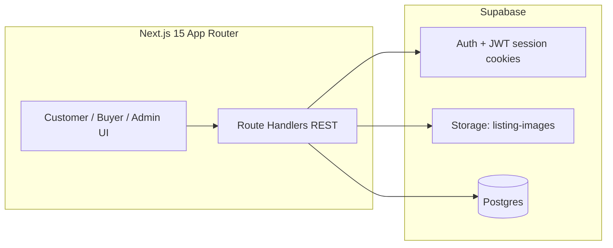

# Waste Marketplace (MVP)

Mobile-first marketplace where **customers** list waste, **buyers** accept pickups, and **admins** oversee operations. Auth and files run on **Supabase**; app data lives in **PostgreSQL** via **Prisma**.

## Architecture



- **Sessions**: Supabase Auth (email/password). Role is stored in **`app_metadata.role`** (set with the service role during signup — not user-editable).
- **Business data**: `users`, `waste_listings` in Postgres — accessed with **Prisma** from API routes (bypasses PostgREST; enable **RLS** later if you expose tables to the Data API).
- **Uploads**: `POST /api/upload` writes to bucket **`listing-images`** using the **service role** on the server.

## Troubleshooting signup (“User not found”, login fails)

1. **`SUPABASE_SERVICE_ROLE_KEY`** must be from the **same Supabase project** as `NEXT_PUBLIC_SUPABASE_URL` and `NEXT_PUBLIC_SUPABASE_ANON_KEY` (Dashboard → Settings → API → *service_role* secret). Signup uses this key to create users with `app_metadata.role`.
2. **App tables** — Prisma only creates `public.users` and `public.waste_listings` after you run migrations against that project’s Postgres (`npx prisma migrate deploy`). Auth users live in `auth.users` automatically; your **profile row** is `public.users`.
3. **Email confirmation** — By default, signup sets `email_confirm` so users can log in immediately. To require email confirmation, set `SUPABASE_AUTOCONFIRM_NEW_USERS=false` in `.env` and ensure your Supabase email templates/provider are configured.

## Setup

1. **Clone & install**

 ```bash
   cd waste-marketplace
   npm install
   ```

2. **Environment** — copy `.env.example` to `.env` and fill values from the Supabase dashboard.

   - Set **`DATABASE_URL`** to your Postgres URL. Prefer Supabase **session** mode or **direct** (port **5432**) so `prisma migrate deploy` runs reliably. If the app uses the **transaction** pooler (port **6543**) in production, run migrations in CI with `DATABASE_URL` temporarily set to the session/direct string for that step.

3. **Database** — after pulling Phase 2, apply the new migration (adds `asking_price`, offers, comments, chat):

   ```bash
   npx prisma migrate deploy
   npx prisma generate
   ```

   Existing listings get `asking_price = 0` until the seller edits the listing or you backfill.

4. **Storage (required for photo uploads)** — Dashboard → **Storage** → **New bucket** → name **`listing-images`** → create → open the bucket → set it **public** (or add a policy so uploads work). Without this bucket, `POST /api/upload` returns **Bucket not found**. To use another name, set `SUPABASE_STORAGE_BUCKET` in `.env`. For production, prefer a private bucket + signed URLs (Phase 2).

5. **Auth settings** — for local dev, consider disabling **email confirmations** (Authentication → Providers → Email) so `signUp` + immediate `signIn` works.

6. **Admin user** — set `ADMIN_EMAIL` in `.env` to your email, then sign up with that email to receive the **admin** role.

7. **Run**

   ```bash
   npm run dev
   ```

   Open [http://localhost:3000](http://localhost:3000).

## REST API (MVP)

| Method | Path | Notes |
|--------|------|--------|
| `POST` | `/api/auth/signup` | Body: email, password, name, role (`customer` \| `buyer`), optional phone/address |
| `POST` | `/api/auth/login` | Sets Supabase cookies |
| `POST` | `/api/auth/logout` | |
| `GET` | `/api/users/me` | Session + Prisma profile |
| `GET` | `/api/listings` | Scope by role; buyers `?scope=mine` for pickups |
| `POST` | `/api/listings` | Customer create |
| `GET` | `/api/listings/:id` | |
| `PATCH` | `/api/listings/:id` | Customer, `open` only |
| `POST` | `/api/listings/:id/cancel` | Customer, `open` → `cancelled` |
| `GET` | `/api/listings/:id/offers` | Seller: all offers; buyer: own offers |
| `POST` | `/api/listings/:id/offers` | Buyer; body `{ amount, currency? }` (upserts pending offer) |
| `POST` | `/api/offers/:id/accept` | Seller (or admin); accepts deal, declines other pendings |
| `POST` | `/api/offers/:id/decline` | Seller |
| `POST` | `/api/offers/:id/withdraw` | Buyer |
| `GET` | `/api/listings/:id/comments` | Thread visible to listing readers |
| `POST` | `/api/listings/:id/comments` | Seller (own listing) or buyer (`open` only) |
| `GET` | `/api/listings/:id/conversations` | Seller: all chats; buyer: own |
| `POST` | `/api/listings/:id/conversations` | Buyer; opens private thread |
| `GET` | `/api/conversations/:id` | Chat metadata |
| `GET` / `POST` | `/api/conversations/:id/messages` | Private messages (poll UI ~5s) |
| `POST` | `/api/listings/:id/complete` | Accepting buyer only |
| `POST` | `/api/upload` | `multipart/form-data` field `file` |

## QA checklist (manual)

- Customer: create → edit → cancel listing; view buyer contact when `accepted`.
- Buyer: accept open listing; second buyer gets **409**; complete accepted listing.
- Invalid/missing quantity or address returns **400** (create).
- Unauthenticated API calls → **401**.

## Phase 2+ (outline)

**Stakeholder feedback & Phase 2 scope:** see [`docs/PHASE2-FEEDBACK.md`](docs/PHASE2-FEEDBACK.md) (responsive full-page UX, asking price + buyer offers, image lightbox, comments & private chat). Additional ideas: maps/distance, notifications, ratings, transaction history.

## Deployment

- **Vercel** (or similar) for Next.js; set all env vars.
- Run `npx prisma migrate deploy` in CI or a release step.
- Prefer **Supabase Storage** with a **private** bucket + signed URLs before production launch; restrict CORS and file types.

## License

Private / your org — add a license if open-sourcing.
